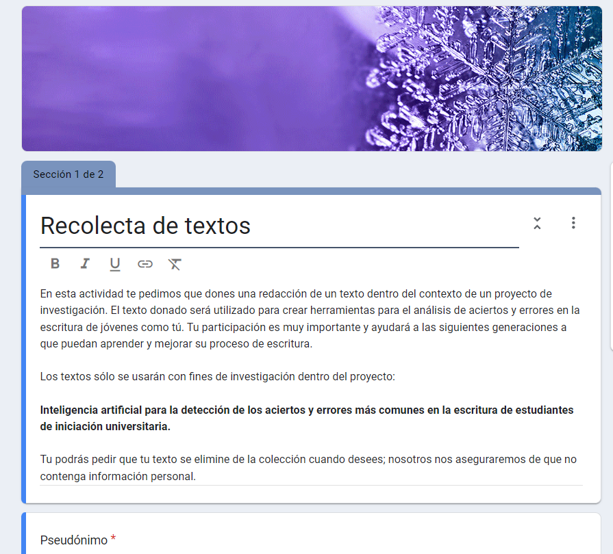
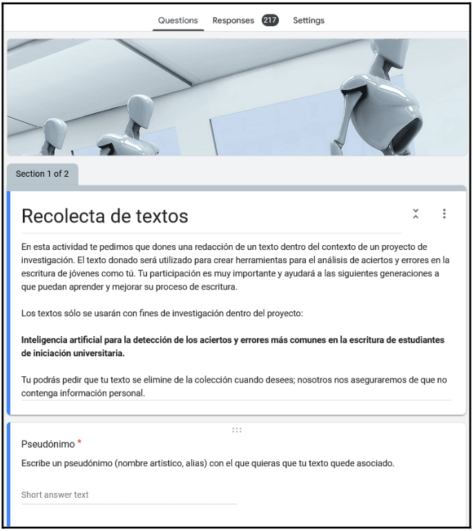

Antes de definir las características de los textos argumentativos que se recolectarían, se realizó un trabajo de revisión de la literatura y discusión colectiva. Se realizó una reunión con los profesores de la ENP 2 que participarían en el proyecto. Todos ellos imparten la asignatura “Formación Cívica y Ética” a estudiantes de Iniciación Universitaria. Se acordó el tema y el formato a seguir para la recolecta de textos. La estrategia para la recolecta de textos diseñada en conjunto con los profesores fue: 
 
 
<ul>
  <li>Presentación del objetivo</li>
  <li>Introducción al tema elegido</li>
  <li>Lectura de nota del periódico preseleccionada</li>
  <li>Debate entre estudiantes solicitud de escritura de un texto argumentando sobre las diversas posturas</li>
</ul>

Se realizó prueba piloto para la recolecta de datos en las aulas de Iniciación universitaria de la UNAM. Debido a las características y condiciones de la población bajo estudio: “estudiantes inscritos en iniciación universitaria en la Escuela Nacional preparatoria No.2” Selección y acuerdo para la aplicación del estudio con estudiantes inscritos en un grupo; se colectaron textos correspondientes con cada nivel de estudios del programa de Iniciación Universitaria. Es decir, se seleccionó una muestra de estudiantes de una población total de 2,186  

<h3> Primera recolecta de textos</h3>

Se recolectaron 103 textos producidos por estudiantes de iniciación universitaria inscritos, los textos representan a estudiantes de los tres grados del programa de Iniciación Universitaria. Se encontró un solo texto que deberá descartarse por carecer de contenido; solamente contiene letras sin sentido. Todos los miembros del equipo han aprendido sobre la teoría de textos argumentativos.

<h3> Segunda recolecta de textos</h3>

Se recolectaron 217 textos producidos por estudiantes de iniciación universitaria, los textos recolectados representan a estudiantes de los tres grados del programa de Iniciación Universitaria. También se incluyeron grupos de estudiantes inscritos en el nivel bachillerato (Escuela Nacional Preparatoria 2). Se realizaron análisis utilizando los algoritmos de Inteligencia Artificial generados con los primeros textos.

<h2>Desarrollo de instrumentos</h2>

Para la recolecta de textos producidos por estudiantes se utilizó Google Forms por su facilidad para recolectar textos y archivos en línea, sin necesidad de registrar un correo electrónico y así mantener el anonimato de los participantes.

    
    
<strong>Cuestionario utilizado en la primera recolecta</strong>

    
    
<strong>Cuestionario utilizado en la segunda recolecta</strong>

